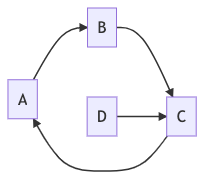
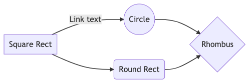
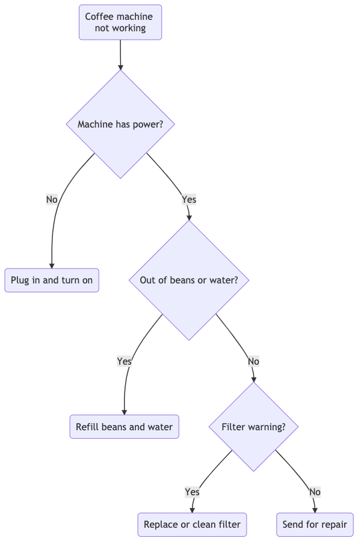
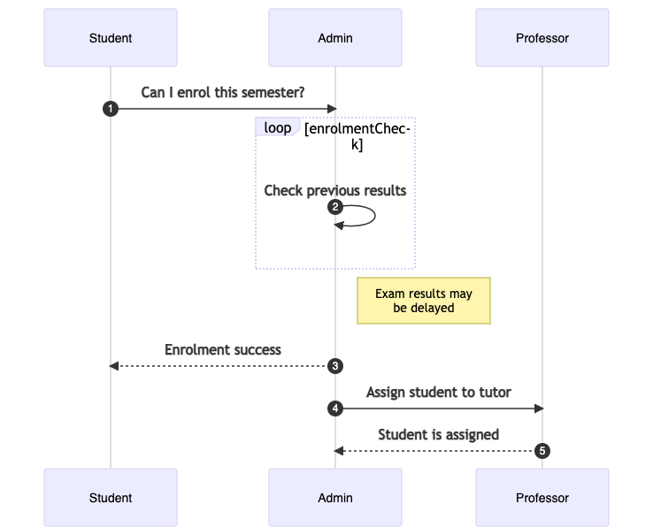
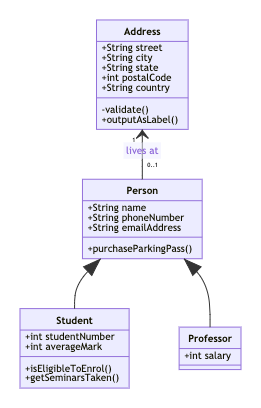
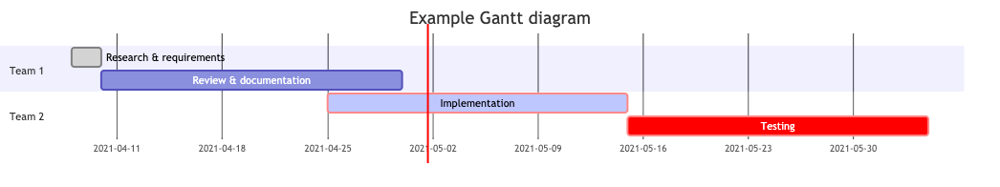

# =Mermaid block

### `=Mermaid` - use diagrams

To render beautiful graphs, sequence and Gantt diagrams and flowcharts, one can use the `=Mermaid` blocks.

```
=begin Mermaid
graph LR
        A-->B
        B-->C
        C-->A
        D-->C
=end Mermaid
```



[Open this example in pod6.in](https://pod6.in/#p=%3Dbegin+Mermaid%0Agraph+LR%0A++++++++A-->B%0A++++++++B-->C%0A++++++++C-->A%0A++++++++D-->C%0A%3Dend+Mermaid)

#### Flowchart

```
=Mermaid
graph LR
    A[Square Rect] -- Link text --> B((Circle))
    A --> C(Round Rect)
    B --> D{Rhombus}
    C --> D
```



[Open this example in pod6.in](https://pod6.in/#p=%3DMermaid%0Agraph+LR%0A++++A%5BSquare+Rect%5D+--+Link+text+-->+B%28%28Circle%29%29%0A++++A+-->+C%28Round+Rect%29%0A++++B+-->+D%7BRhombus%7D%0A++++C+-->+D)

```
=Mermaid
graph TD
   A(Coffee machine <br>not working) --> B{Machine has power?}
   B -->|No| H(Plug in and turn on)
   B -->|Yes| C{Out of beans or water?} -->|Yes| G(Refill beans and water)
   C -->|No| D{Filter warning?} -->|Yes| I(Replace or clean filter)
   D -->|No| F(Send for repair)
```



[Open this example in pod6.in](https://pod6.in/#p=%3DMermaid%0Agraph+TD%0A+++A%28Coffee+machine+<br>not+working%29+-->+B%7BMachine+has+power%3F%7D%0A+++B+-->%7CNo%7C+H%28Plug+in+and+turn+on%29%0A+++B+-->%7CYes%7C+C%7BOut+of+beans+or+water%3F%7D+-->%7CYes%7C+G%28Refill+beans+and+water%29%0A+++C+-->%7CNo%7C+D%7BFilter+warning%3F%7D+-->%7CYes%7C+I%28Replace+or+clean+filter%29%0A+++D+-->%7CNo%7C+F%28Send+for+repair%29)

#### UML sequence diagram

```
=Mermaid
sequenceDiagram
    autonumber
    Student->>Admin: Can I enrol this semester?
    loop enrolmentCheck
        Admin->>Admin: Check previous results
    end
    Note right of Admin: Exam results may <br> be delayed
    Admin-->>Student: Enrolment success
    Admin->>Professor: Assign student to tutor
    Professor-->>Admin: Student is assigned
```



[Open this example in pod6.in](https://pod6.in/#p=%3DMermaid%0AsequenceDiagram%0A++++autonumber%0A++++Student->>Admin%3A+Can+I+enrol+this+semester%3F%0A++++loop+enrolmentCheck%0A++++++++Admin->>Admin%3A+Check+previous+results%0A++++end%0A++++Note+right+of+Admin%3A+Exam+results+may+<br>+be+delayed%0A++++Admin-->>Student%3A+Enrolment+success%0A++++Admin->>Professor%3A+Assign+student+to+tutor%0A++++Professor-->>Admin%3A+Student+is+assigned)

#### UML class diagram

```
=Mermaid
classDiagram
   Person <|-- Student
   Person <|-- Professor
   Person : +String name
   Person : +String phoneNumber
   Person : +String emailAddress
   Person: +purchaseParkingPass()
   Address "1" <-- "0..1" Person:lives at
   class Student{
      +int studentNumber
      +int averageMark
      +isEligibleToEnrol()
      +getSeminarsTaken()
    }
    class Professor{
      +int salary
    }
    class Address{
      +String street
      +String city
      +String state
      +int postalCode
      +String country
      -validate()
      +outputAsLabel()
    }
```



[Open this example in pod6.in](https://pod6.in/#p=%3DMermaid%0AclassDiagram%0A+++Person+<%7C--+Student%0A+++Person+<%7C--+Professor%0A+++Person+%3A+%2BString+name%0A+++Person+%3A+%2BString+phoneNumber%0A+++Person+%3A+%2BString+emailAddress%0A+++Person%3A+%2BpurchaseParkingPass%28%29%0A+++Address+"1"+<--+"0..1"+Person%3Alives+at%0A+++class+Student%7B%0A++++++%2Bint+studentNumber%0A++++++%2Bint+averageMark%0A++++++%2BisEligibleToEnrol%28%29%0A++++++%2BgetSeminarsTaken%28%29%0A++++%7D%0A++++class+Professor%7B%0A++++++%2Bint+salary%0A++++%7D%0A++++class+Address%7B%0A++++++%2BString+street%0A++++++%2BString+city%0A++++++%2BString+state%0A++++++%2Bint+postalCode%0A++++++%2BString+country%0A++++++-validate%28%29%0A++++++%2BoutputAsLabel%28%29%0A++++%7D)

#### Gantt diagram

```
 =Mermaid
 gantt
 title Example Gantt diagram
    dateFormat  YYYY-MM-DD
    section Team 1
    Research & requirements :done, a1, 2021-04-08, 2021-04-10
    Review & documentation : after a1, 20d
    section Team 2
    Implementation      :crit, active, 2021-04-25  , 20d
    Testing      :crit, 20d
```



[Open this example in pod6.in](https://pod6.in/#p=+%3DMermaid%0A+gantt%0A+title+Example+Gantt+diagram%0A++++dateFormat++YYYY-MM-DD%0A++++section+Team+1%0A++++Research+%26+requirements+%3Adone%2C+a1%2C+2021-04-08%2C+2021-04-10%0A++++Review+%26+documentation+%3A+after+a1%2C+20d%0A++++section+Team+2%0A++++Implementation++++++%3Acrit%2C+active%2C+2021-04-25++%2C+20d%0A++++Testing++++++%3Acrit%2C+20d)

## Contributing

This is an open source program. Feel free to fork and contribute.

In order to keep the match between this documentation and the last release, please contribute and pull requests on the dedicated develop branch.

## Useful links

<div align="center">
<table border=0><tr><td valign=top><div align="center">

##### specification

</div>

- [Source](https://github.com/podlite/podlite-specs)
- [in HTML](https://podlite.org/specification)
- [Discussions](https://github.com/podlite/podlite-specs/discussions)

<div align="center">

##### implementation

</div>

- [Source](https://github.com/podlite/podlite)
- [Changelog](https://github.com/podlite/podlite/releases)
- [Issues](https://github.com/podlite/podlite/issues)

</td><td valign=top><div align="center">

##### publishing system

</div>

- [Podlite-web](https://github.com/podlite/podlite-web)
- [How-to article](https://zahatski.com/2022/8/23/1/start-you-own-blog-site-with-podlite-for-web)
- [Issues](https://github.com/podlite/podlite-specs/issues)
- [Changelog](https://github.com/podlite/podlite-web/releases)
- [Example: Knowledge base for <br/> raku programming language](https://raku-knowledge-base.podlite.org/)

</td><td valign=top><div align="center">
  
##### desktop viewer/editor

</div>

- [Podlite-desktop](https://github.com/podlite/podlite-desktop)
- [Releases](https://github.com/podlite/podlite-desktop/releases)
- [Issues](https://github.com/podlite/podlite-desktop/issues)

</td><td valign=top><div align="center">

##### online resurces

 </div>

- [podlite.org](https://podlite.org)
- [pod6.in](https://pod6.in/)
- [github.com/podlite](https://github.com/podlite/)
- [Podlite project updates](https://podlite.org/contents)
- [Funding the ongoing development](https://opencollective.com/podlite)

</td></tr></table>
</div>

## AUTHOR

Copyright (c) 2021-2025 Aliaksandr Zahatski

## License

Released under a MIT License.
